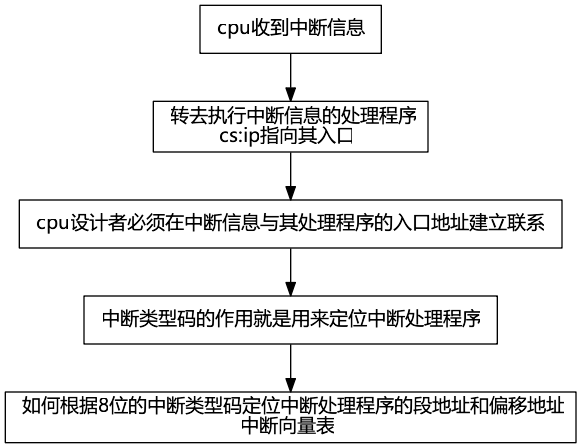
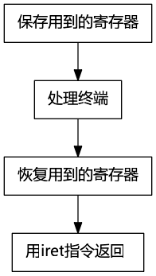
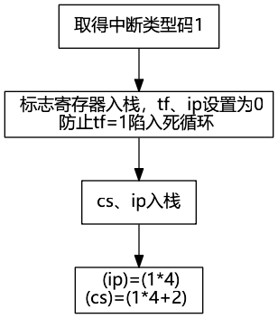

<!-- @import "[TOC]" {cmd="toc" depthFrom=1 depthTo=6 orderedList=false} -->

<!-- code_chunk_output -->

* [内中断](#内中断)
	* [1. 内中断的产生](#1-内中断的产生)
	* [2. 中断处理程序](#2-中断处理程序)
	* [3. 中断向量表](#3-中断向量表)
	* [4. 中断过程](#4-中断过程)
	* [5. 中断处理程序和iret指令](#5-中断处理程序和iret指令)
	* [6. 除法错误中断的处理](#6-除法错误中断的处理)
	* [7. 编程处理0号中断](#7-编程处理0号中断)
	* [8. 单步中断](#8-单步中断)
	* [9. 响应中断的特殊情况](#9-响应中断的特殊情况)

<!-- /code_chunk_output -->

相关指令: [iret](#5-中断处理程序和iret指令)、

# 内中断

通用cpu可以在执行完当前执行的指令之后，检测到从cpu外部发送过来的或内部产生的一种特殊信息，并且可以立即对所接收到的信息进行处理。这种信息叫**中断信息**。中断的信息是指，cpu不再接着向下执行，而去处理这个特殊信息。

**中断信息**是要求cpu马上进行某种处理，并向所要进行的该种处理提供了必备的参数的通知信息。

cpu的中断可以来自内部或外部。

## 1. 内中断的产生

中断源(中断信息的来源)有：

|中断源|中断类型码|
|:---|:---:|
|除法错误，比如div指令产生的除法溢出|0|
|单步执行|1|
|执行`into`指令|4|
|执行`int`指令|该指令的格式为`int n`<br>指令中的`n`为字节型立即数<br>n为立即码|

## 2. 中断处理程序



## 3. 中断向量表

**中断类型码**通过**中断向量表**找到对应的**中断处理程序**的入口地址。

**中断向量表**就是**中断向量**的列表。

**中断向量**就是**中断处理程序**入口地址的。

**中断向量表**在内存中保存，其中存放着256个**中断源**所对应的中断处理程序的入口。

8086中**中断向量表**制定放在内存地址`0`处。从`0000:0000`到`0000:03ff`的`1024`个内存单元中存放着中断向量表。一个表项占两个字，高地址存`段地址`，低地址存`偏移地址`。

## 4. 中断过程

|中断过程|简洁描述|
|:---|:---|
|从中断信息中取得中断类型码|取得中断类型码`N`|
|标志寄存器的值入栈<br>(中断过程中会改变标志寄存器的值)|`pushf`|
|设置标志寄存器的第8位`tf`和第9位`if`的值为0|`TF=0`<br>`IF=0`|
|`cs`的内容入栈<br>`ip`的内容入栈|`push cs`<br>`push ip`|
|从中断向量表中读取中断处理程序的`ip`和`cs`|`(ip)=(N*4)`<br>`(cs)=(N*4+2)`|


## 5. 中断处理程序和iret指令

中断程序的编写方法:



`iret`指令等于`pop IP`;`pop CS`;`popf`，通常和硬件自动完成的中断过程配合使用。

## 6. 除法错误中断的处理

```asm
mov ax,1000h
mov bh,1
div bh
```

除数为8位，`al`存商，1000在al中溢出。

## 7. 编程处理0号中断

程序：`do0`

功能：在发生除法溢出错误后，产生0号中断信息，cpu执行`do0`，屏幕中间提示`"overflow"`，返回到操作系统中。

问题：`do0`应放在内存中。但除法溢出随时可能发生，cpu随时可能将`cs:ip`指向`do0`,那么`do0`应该放在哪里呢？

解决：`0000:0000`~`0000:03ff`的`1024`个字节是系统存放中断处理程序的入口地址的中断像量表。但其实中断事件没有`256`个，从`0000:0200`到`0000:02ff`的`256`个字节都是空的。所以我们可以将`do0`传送到内存`0000:0200`处。将`do0`的段地址`0`放在`0000:0002`字单元中，偏移地址`200h`放在`0000:0000`字单元中。

```asm
assume cs:code

code segment
start:

	;do0安装程序,将do0的代码复制到0:0200中
	mov ax,cs
	mov ds,ax			;源段地址
	mov si,offset do0	;源偏移地址
	mov ax,0
	mov es,ax			;目的段地址
	mov di,200h			;目的偏移地址
	mov cx,offset do0end-offset do0			;传送字节数
	;"-"是编译器识别的运算符号，编译器可以用它进行两个常数的减法
	cld					;将方向标志位df置1
	rep movsb			;传送字节

	;设置中断向量表，设置0号表项
	mov ax,0
	mov es,ax
	mov word pter es:[0*4],200h
	mov word pte es:[0*4+2],0

	mov ax,4c00h
	int 21h
do0:
	jmp short do0start
	db 'overflow!'		;不是可执行代码，所以上面跳转
do0start:
	;显示字符串"overflow!"	
	mov ax,cs
	mov ds,ax
	mov si,202h			;ds:si指向字符串

	mov ax,0b800h
	mov es,ax
	mov di,12*160+36*2	;设置es:di指向显存空间的中间地址
	mov cx,9
s:
	mov al,[si]
	mov es:[di],al
	inc si
	add di,2
	loop s
	mov ax，4c00h
	int 21h

do0end:
	nop
code ends
end start
```

## 8. 单步中断

cpu在执行完一条指令后，如果检测到标志寄存器的`tf`位为1，则产生单步中断，引发中断过程。单步中断的中断类型码为1，引发的中断过程如下：



`debug`每次`t`后显示寄存器的状态就是因为`debug`提供了单步中断的中断处理程序。在使用`t`时，`debug`将tf置为1，则在cpu执行完这条指令后就引发单步中断。

cpu提供单步中断功能的原因是为单步跟踪程序的执行过程提供了实现机制。

## 9. 响应中断的特殊情况

在执行完向`ss`寄存器传送数据的指令后，即便是发生中断，cpu也不会响应。因为对`ss`和`sp`的设置应连续完成。
 

