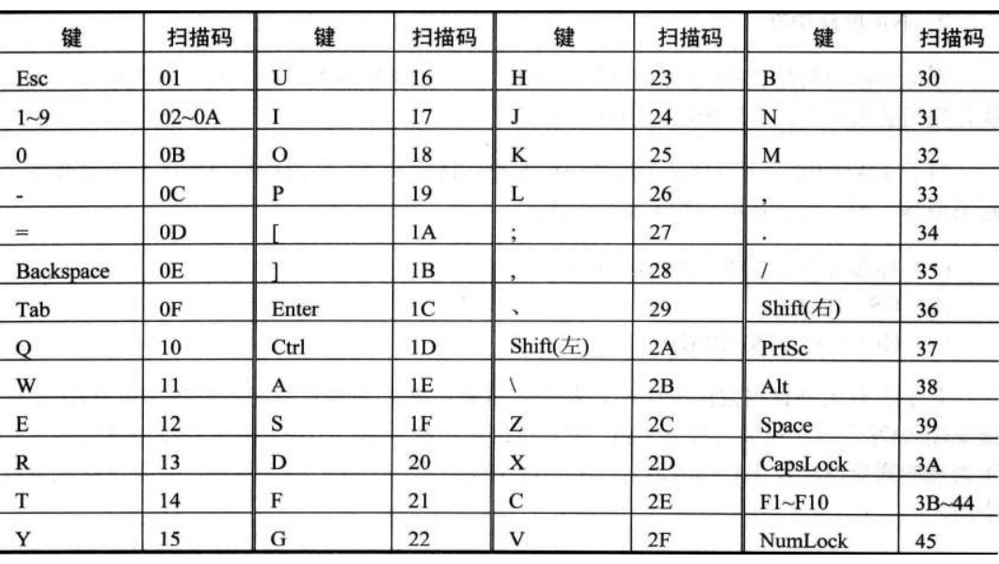
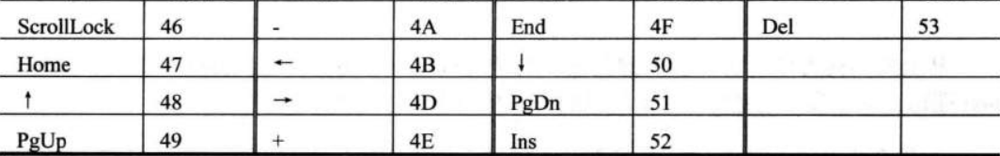
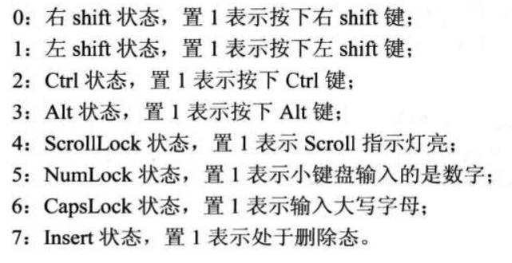

<!-- TOC -->

- [外中断](#外中断)
    - [1 接口芯片和端口](#1-接口芯片和端口)
    - [2 外中断信息](#2-外中断信息)
    - [3 PC机键盘的处理过程](#3-pc机键盘的处理过程)
    - [3.1 键盘的输入](#31-键盘的输入)
    - [3.2 引发9号中断](#32-引发9号中断)
    - [3.3 执行int9中断例程](#33-执行int9中断例程)
    - [4 编写int 9中断例程](#4-编写int-9中断例程)
    - [检测点15.1](#检测点151)
    - [5 安装新的int 9中断例程](#5-安装新的int-9中断例程)

<!-- /TOC -->


# 外中断

CPU除了能执行指令,进行运算,还能对外部设备进行控制,接收其输入,向其进行输出.

要及时处理外设的输入需要解决:

1. 外设的输入随时可能发生,CPU如何得知
2. CPU从何处得到外设的输入

## 1 接口芯片和端口

CPU通过端口和外部设备进行联系

## 2 外中断信息

问:外设随时可能发生需要CPU及时处理的事件,CPU是如何得知并进行处理

答:CPU提供中断来满足这种需求.

|中断分类| |
|:---|:---|
|内部中断|当CPU的内部有需要处理的事情发生时,将产生中断信息,引发中断过程|
|外部中断|当CPU的外部部有需要处理的事情发生时(比如:外设的输入到达,相关芯片将向CPU发出相应的终端信息),CPU在执行完当前的指令后,可以检测到大送过来的中断信息,引发中断过程,处理外设的输入|

|外中断源<br>的种类|可屏蔽中断|不可屏蔽中断|
|:---|:---|:---|
|含义|**CPU可以不响应的中断**<br>检测到可屏蔽中断信息时,如果标志寄存器`IF=1`,则CPU在执行完当前指令后响应中断<br>`IF=0`,则不响应可屏蔽中断|**CPU必须相应的外中断**|
|中断过程|与内中断过程除第一步略有不同,基本和内中断相同<br>`IF`置`0`的原因是,在进入中断处理程序后,禁止其他的可屏蔽中断<br>如果在进入中断处理程序中需要处理可屏蔽中断可将`IF`置为1<br>`sti`设置`IF=1`<br>`cli`设置`IF=0`|不可中断类型码固定为2,所以中断过程中不需要取中断码<br>1.标志寄存器入栈,`IF=0`,`TF=0`<br>2.CS,IP入栈<br>3.(IP)=8,(CS)=(0AH)|
|常见中断|几乎所有由外设引发的外中断都是可屏蔽中断|当外设有需要处理的事情(比如键盘输入)时,相关芯片向CPU发出可屏蔽中断信息|

## 3 PC机键盘的处理过程

## 3.1 键盘的输入

键盘上的每一个键相当于一个开关，键盘中有一个芯片对每个键的开关状态进行扫描。

每按下一个键，开关接通，该芯片产生一个扫描码，**扫描码**说明了按下的键在键盘上的位置。扫描码被送入主板上的相关接口芯片的寄存器中，该寄存器的端口地址为`60h`。

松开按下的键时，也产生一个扫描码，扫描码说明了松开的键在键盘上的位置。松开按键时产生的扫描码也被送入`60h`端口中。

一般将按下一个键时产生的扫描码称为**通码**，松开一个键产生的扫描码称为**断码**。扫描码长度为一个字节，**通码的第7位为0，断码的第7位为1**，即：**断码=通码+80h**




## 3.2 引发9号中断

键盘的输入到达`60h`端口时，相关的芯片就会向CPU发出中断类型码为9的可屏蔽中断信息。CPU检测到该中断信息后，如果IF=1，则响应中断，引发中断过程。

## 3.3 执行int9中断例程

BIOS提供了`int 9`中断例程，用来进行基本的键盘处理。主要工作有：

1. 读出`60h`端口中的扫描码
2. 如果是字符键的扫描码，将该扫描码和它对应的字符码送入内存中的BIOS键盘缓冲区；如果是控制键（eg：ctrl）和切换键（eg：CapsLock）的扫描码，则将其转变为**状态字节**（**用二进制位记录控制键和切换键状态的字节**）写入内存中存储状态字节的单元。
3. 对键盘系统进行相关的控制。比如说：向相关芯片发出应答信息。

**BIOS键盘缓冲区**是系统启动后，BIOS用于存放`int 9`中断例程所接收的键盘输入的**内存区**。该内存区可以存储15个键盘输入，因为`int 9`中断例程除了接收扫描码外，还要产生和扫描码对应的字符码，所以在BIOS键盘缓冲区中，**一个键盘输入用一个字单元存放，高位字节存放扫描码，低位字节存放字节码**。

`0040:17`单元存储**键盘状态字节**,该字节**记录了控制键和切换键的状态**.键盘状态字节各位记录如下:



## 4 编写int 9中断例程

键盘输入的处理过程:键盘产生扫描码→扫描码送入60端口→引发9号中断→CPU执行int 9中断例程处理键盘输入

我们可以编写`int 9`键盘中断例程,按照自己的意图来处理键盘的输入.因为BIOS提供的`int 9`中断例程已经对这些硬件细节进行了处理,我们只要在自己编写的中断例程中调用BIOS的`int 9`中断例程就可以了.

编程:在屏幕中间依次显示"a"~"z",并可以让人看清.在显示的过程中,按下<kbd>esc</kbd>键后改变显示的颜色.

键盘输入到达` 60h `端口后,就会引发` 9 `号中断,CPU转去执行` int 9 `中断例程.我们可以编写如下的` int 9 `中断例程:

1. 从` 60h `端口中读出键盘的输入:` in al,60h `
2. 调用bios的` int 9 `中断例程,处理其他硬件细节
3. 判断是否为<kbd>Esc</kbd>的扫描码,如果是,改变显示的颜色后返回,如果不是则直接返回.在程序返回前,将中断向量表中的` int 9 `的中断例程的入口地址恢复为原来的地址,否则程序返回后,别的程序无法使用键盘.

```asm
;kbdaz.asm
assume cs:code

stack segment
    db 128 dup (0)
stack ends

data segment
    dw 0,0
data ends

code segment
start:
    mov ax,stack
    mov ss,ax
    mov sp,128

    mov ax,data
    mov ds,ax

    mov ax,0
    mov es,ax

    push es:[9*4]
    pop ds:[0]
    push es:[9*4+2]
    pop ds:[2];将原来的int 9中断例程的入口地址保存在ds:0,ds:2中

    mov word ptr es:[9*4],offset int9
    mov es:[9*4+2],cs;在中断向量表中设置新的int 9中断例程的入口地址

    mov ax,0b800h
    mov es,ax
    mov ah,'a'
s:
    mov es:[160*12+40*2],ah
    call delay
    inc ah
    cmp ah,'z'
    jna s

    mov ax,0
    mov es,ax

    push ds:[0]
    pop  es:[9*4]
    push ds:[2]
    pop es:[9*4+2];将中断向量表中int 9中断例程的入口地址恢复为原来的地址

    mov ax,4c00h
    int 21h

delay:
    push ax
    push dx
    mov dx,10h;循环10000000次
    mov ax,0
s1:
    sub ax,1
    sbb dx,0
    cmp ax,0
    jne s1
    cmp dx,0
    jne s1
    pop dx
    pop ax
    ret

int9:
    push ax
    push bx
    push es

    in al,60h

    pushf
    pushf
    pop bx
    and bh,11111100b
    push bx
    popf
    call dword ptr ds:[0];对int指令进行模拟,调用原来的int 9中断例程

    cmp al,1
    jne int9ret

    mov ax,0b800h
    mov es,ax
    inc byte ptr es:[160*12+40*2+1];改变颜色

int9ret:
    pop es
    pop bx
    pop ax
    iret

code ends
end start
```

## 检测点15.1

1. 精简指令

|原指令|可精简为|
|:---|:---|
|`pushf`<br>`pushf`<br>`pop ax`<br>`and ah,11111100b`<br>`push ax`<br>`popf`<br>`call dword ptr ds:[0]`|`pushf`<br>`call dword ptr ds:[0]`|

2. 查找[kbdaz.sm](./kbdaz.asm)的问题

|被更改程序段|更改为|
|:---|:---|
|`mov word ptr es:[9*4],offset int9`<br>`mov es:[9*4+2],cs`|`cli`<br>`mov word ptr es:[9*4],offset int9`<br>`mov word ptr es:[9*4+2],cs`<br>`sti`|
|`mov ax,0`<br>`mov es,ax`<br>`push ds:[0]`<br>`pop es:[9*4]`<br>`push ds:[2]`<br>`pop es:[9*4+2]`|`cli`<br>`mov ax,0`<br>`mov es,ax`<br>`push ds:[0]`<br>`pop es:[9*4]`<br>`push ds:[2]`<br>`pop es:[9*4+2]`<br>`sti`|

## 5 安装新的int 9中断例程

任务:安装一个新的` int 9 `中断例程

功能:在DOS下,按<kbd>F1</kbd>改变当前屏幕的显示颜色,其他的键照常处理

分析:

|功能|实现|
|:---|:---|
|改变屏幕的颜色|改变从B8000H开始的4000个字节的所有奇地址单元中的内容|
|其他键照常处理|调用原` int 9 `中断处理程序,来处理其他键盘输入|
|原` int 9 `中断例程入口地址的保存|新的` int 9 `中断例程需要调用原` int 9 `中断例程,所以,要保存原` int 9 `中断例程的入口地址<br>因为安装程序返回后地址将丢失,我们将地址保存在` 0:200 `单元处|
|新的` int 9 `中断例程的安装|新的` int 9 `中断例程安装在` 0:204 `处|

```asm
;csc.asm==changeScreenColor.asm
assume cs:code

stack segment
    db 128 dup (0)
stack ends

code segment
start:
    mov ax,stack
    mov ss,ax
    mov sp,128

    push cs
    pop ds

    mov ax,0
    mov es,ax

    mov si,offset int9
    mov di,204h
    mov cs,offset int9end-offset int9
    cld
    rep movsb

    push es:[9*4]
    pop es:[200h]
    push es:[9*4+2]
    pop es:[202h]

    cli
    mov word ptr es:[9*4],204h
    mov word ptr es:[9*4+2],0
    sti

    mov ax,4c00h
    int 21h

int9:
    push ax
    push bx
    push cx
    push dx

    in al,60h

    pushf
    call dword ptr cs:[200h];当此中断时执行0:200

    cmp al,3bh;F1的扫描码是3bh
    jne int9ret

    mov ax,0b800h
    mov es,ax
    mov bx,1
    mov cx,2000
s:
    int byte ptr es:[bx]
    add bx,2
    loop s
int9ret:
    pop es
    pop cx
    pop bx
    pop ax
    iret
int9end:
    nop
code ends
end start
    
```

CPU处理外设输入的通常处理方法:

1. 外设的输入送入端口
2. 向CPU发出外中断(可屏蔽中断)信息
3. CPU检测到可屏蔽中断信息,如果` IF=1 `,CPU在执行完当前指令后响应中断,执行相应的中断例程
4. 可在中断例程中实现对外设输入的处理


**端口和中断机制,是CPU进行I/O的基础**

