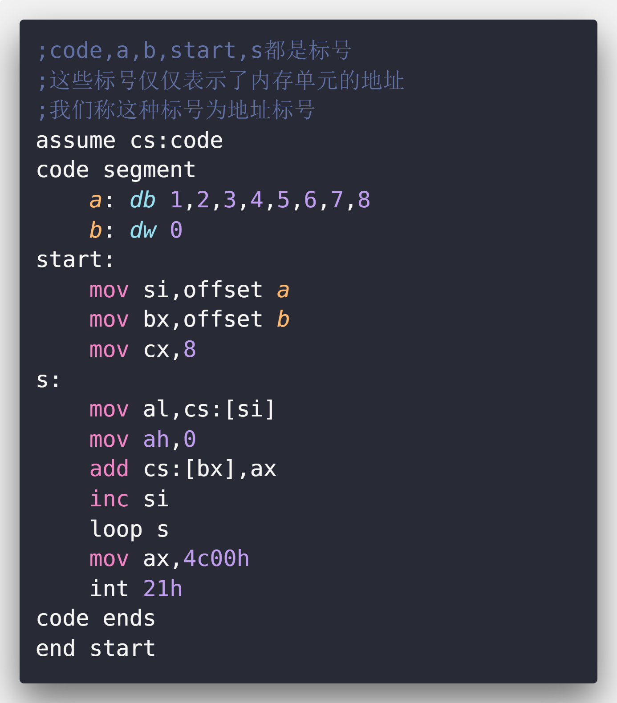
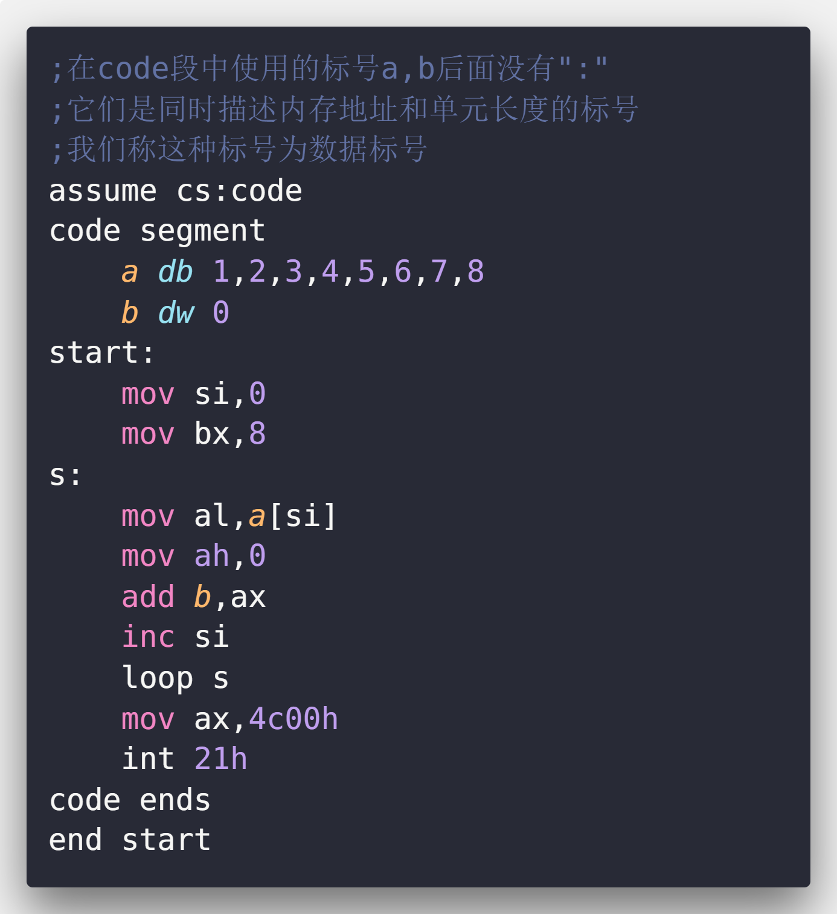

<!-- TOC -->

- [直接定址表](#直接定址表)
    - [1 描述了单元长度的标号](#1-描述了单元长度的标号)
    - [检测点 16.1](#检测点-161)
    - [2 在其他段中使用数据标号](#2-在其他段中使用数据标号)
    - [检测点 16.2](#检测点-162)
    - [3 直接定址表](#3-直接定址表)
    - [4 程序入口地址的直接定址表](#4-程序入口地址的直接定址表)
    - [实验16 编写包含多个功能子程序的中断例程](#实验16-编写包含多个功能子程序的中断例程)

<!-- /TOC -->

# 直接定址表

## 1 描述了单元长度的标号

|地址标号|数据标号|
|:---:|:---:|
|||

## 检测点 16.1

补全程序:

```asm
assume cs:code
code segment
    a dw 1,2,3,4,5,6,7,8
    b dd 0
start: 
    mov si, 0
    mov cx, 8
s:  
    mov ax, a[si]
    add word ptr b[0], ax
    adc word ptr b[2], 0
    add si, 2
    loop s
    mov ax, 4c00H
    int 21H
code ends
end start
```

## 2 在其他段中使用数据标号

一般来说,我们将数据定义带非代码段.在这些段中,我们也可以使用数据标号来描述存储数据的单元的地址和长度.**在后面加有":"的地址标号,只能在代码段中使用,不能在其他段中使用**

```asm
;将data段中a标号处的8个数据累加
;结果存储到b标号处的字中
assume cs:code,ds:data
data segment
    a db 1,2,3,4,5,6,7,8
    b dw 0
data ends
code segment
start:
    mov ax,data
    mov ds,ax

    mov si,0
    mov cx,8
s:
    mov al,a[si];编译为:mov al,[si+0]
    ;如果想在代码段中直接使用数据标号访问数据
    ;需要用伪指令assume将标号所在的段和一个段寄存器联系起来
    ;否则在编译的时候无法确定标号的段地址在哪个寄存器
    ;还需要在程序中使用指令对该段寄存器进行设置
    mov ah,0
    add b,ax;编译为:mov [8],ax
    ;直接用数据标号访问数据
    inc si
    loop s

    mov ax,4c00h
    int 21h
code ends
end start
```

可以**将标号当做数据来定义**,此时,编译器将**标号所表示的地址当做数据的值**.

```asm
data segment
    a db 1,2,3,4,5,6,7,8
    b dw 0
    c dw a,b;c dw offset a,offset b
    ;数据标号c处存储的两个字型数据为标号a,b的偏移地址
    d dd a,b;d dd offset a,seg a,offset b,seg b
    ;数据标号d处存储的两个双字型数据为标号a,b的偏移地址和段地址
data ends
```

## 检测点 16.2

补全程序

```asm
;将data段中a处的8个数据累加到b处
assume cd:code,es:data
data segment
    a db 1,2,3,4,5,6,7,8
    b dw 0
data ends
code segment
start:
    mov ax,data;填空
    mov ds,ax;填空
    mov si,0
    mov cs,8
s:
    mov al,a[si]
    mov ah,0
    add b,ax
    inc si
    loop s

    mov ax,4c00h
    int 21h
code ends
```

## 3 直接定址表

使用查表的方法编写相关程序的技巧

编写子程序:以16禁止的形式在屏幕中间显示给定的字节型数据

分析:一个字节需要用两个16进制数码来表示,所以子程序需要在屏幕上显示两个"0~F"的字符

流程:将一个字节的高4位和低4位分开,如果数值为0,则显示0,依次类推.但是这样程序中要使用多条比较,转移指令.程序长且混乱.我们可以建立一张表,表中依次存储"0~F",我们通过数值0~15直接查找对应的字符.

```asm
;子程序如下
;用al传送要显示的数据
showbyte:
    jmp short show
    table db '0123456789ABCDEF'
show:
    push bx
    push es
    
    mov ah,al
    shr ah,1
    shr ah,1
    shr ah,1
    shr ah,1;右移4位,ah中得到高4位的值
    and al,00001111b;al中为低4位的值
    mov bl,ah
    mov bh,0
    mov ah,table[bx];相当于table的偏移地址
    
    mov bx,0b800h
    mov es,bx
    mov es:[160*12+40*2],ah
    
    mov bl,al
    mov bh,0
    mov al,table[bx]

    mov es:[160*12+40*2+2],al
    
    pop es
    pop bx
    ret
```

## 4 程序入口地址的直接定址表

我们可以在直接定址表中存储子程序的地址,从而方便地实现不同子程序的调用.

## 实验16 编写包含多个功能子程序的中断例程


