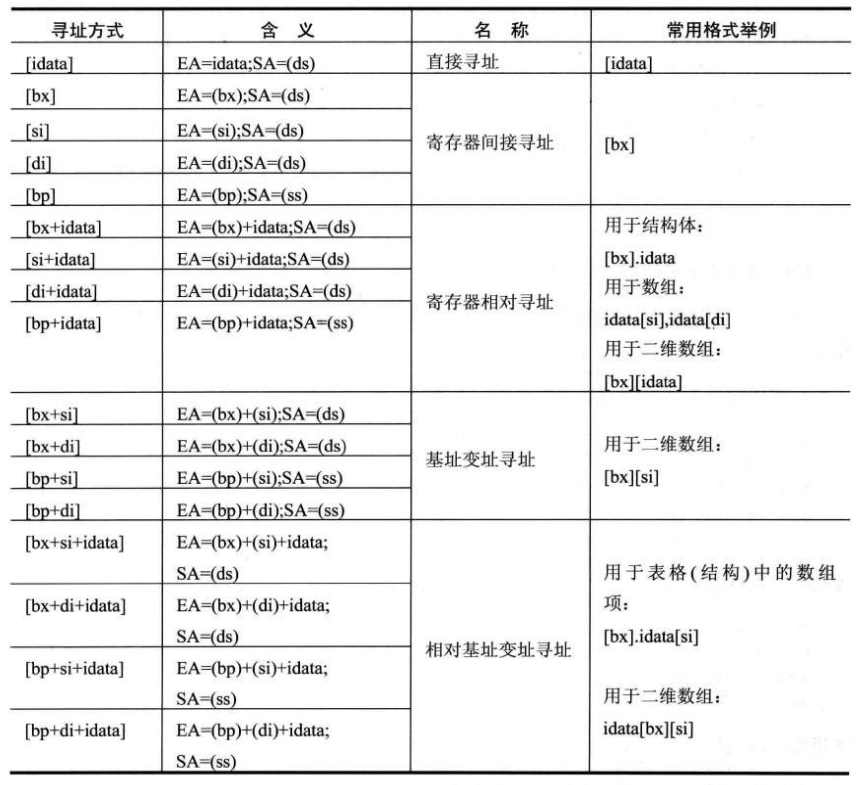
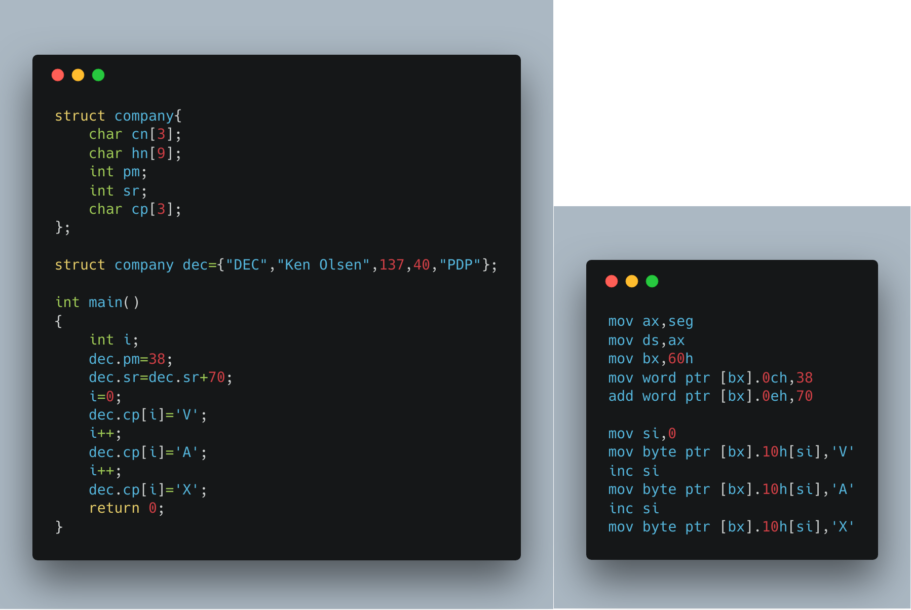
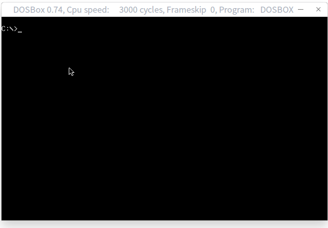

<!-- @import "[TOC]" {cmd="toc" depthFrom=1 depthTo=6 orderedList=false} -->

<!-- code_chunk_output -->

* [数据处理的两个基本问题](#数据处理的两个基本问题)
	* [1-`bx`、`si`、`di`和`bp`](#1-bx-si-di和bp)
	* [2-机器指令处理的数据在什么地方](#2-机器指令处理的数据在什么地方)
	* [3-汇编语言中数据位置的表达](#3-汇编语言中数据位置的表达)
	* [4-寻址方式](#4-寻址方式)
	* [5-指令要处理的数据有多长](#5-指令要处理的数据有多长)
	* [6-寻址方式的综合应用](#6-寻址方式的综合应用)
	* [7-div指令](#7-div指令)
	* [8-伪指令dd](#8-伪指令dd)
	* [9-dup](#9-dup)
	* [实验７　寻址方式在结构化数据访问中的应用](#实验7-寻址方式在结构化数据访问中的应用)

<!-- /code_chunk_output -->

# 数据处理的两个基本问题

1. 处理的数据在什么地方
2. 要处理的数据有多长

定义描述性符号:`reg`表示一个寄存器、`sreg`表示一个段寄存器。

`reg`包括：`ax[h,l]`,`bx[h,l]`,`cx[h,l]`,`dx[h,l]`,`sp`,`bp`,`si`,`di`
`sreg`包括：`ds`、`ss`、`cs`、`es`

## 1-`bx`、`si`、`di`和`bp`

1. 在8086CPU中，只有这四个寄存器可以用在`[...]`中寻址
2. 在`[...]`中，这四个寄存器可以单独出现，或只能以4种组合出现:`bx`和`si`、`bx`和`di`、`bp`和`si`、`bp`和`di`
3. 只要在`[...]`中使用`bp`，而没有显性指出段地址，段地址默认在`ss`中

## 2-机器指令处理的数据在什么地方

机器指令的处理分为三类：**读取**、**写入**、**运算**

机器指令并不关心数据的值是多少，只关心指令执行的前一刻，它将要处理的数据所在的位置。指令在执行前，所要处理的数据可以在三个地方：**CPU内部**、**内存**、**端口**。

## 3-汇编语言中数据位置的表达

|概念|例子|
|:---:|:---:|
|立即数|`mov ax,1`<br>`add bx,2000h`|
|寄存器|`mov ax,bx`<br>`mov ds:[0],bx`|
|段地址(SA)和偏移地址(EA)|`mov ax,[0]`<br> `mov ax,[bx+si+8]`<br> `mov ax,[bp+si+8]`|

## 4-寻址方式



## 5-指令要处理的数据有多长

1. 通过寄存器名指明要处理的数据的尺寸。eg:`mov ax,1`
2. 在没有寄存器名存在的情况下，用操作符`X ptr`指明**内存单元**的长度，`X`可以为`word`或`byte`。eg:`mov word ptr ds:[0],1`

## 6-寻址方式的综合应用




一个结构化的数据包含了多个数据项，而数据项的类型又不相同，有的是字型数据，有的是字节型数据，有的是数组(字符串)。一般来说，我们可以用`[bx+idata+si]`的方式来访问结构体中的数据。用`bx`定位整个结构体，用`idata`定位结构体中的某一个数据，用`si`定位数组项中的每个元素。

## 7-div指令

```asm
div reg
div 内存单元

;计算100001/100
mov dx,1
mov ax,86a1h    ;100001的16进制为186a1h
mov bx,100
div bx
```
1. 除数:有8位和16位两种，在一个`reg`或内存单元中
2. 被除数：默认在`AX`或`DX`中。
    * 如果除数为８位，被除数则为16位，默认在`AX`中存放；
    * 如果除数为16位，被除数则为32位，在`DX`和`AX`中存放，`DX`存放高16位，`AX`存放低16位
3. 如果除数为8位，则`AL`存商，`AH`存余数。如果除数为16位，则`AX`存商，`DX`存余数

## 8-伪指令dd

db定义字节型数据、dw定义字型数据、dd定义双字型数据。

```asm
;用div计算data段中第一个数据除以第二个数据后的结果，商存在第三个数据的存储单元中
mov ax,data
mov ds,ax
mov ax,ds:[0]
mov dx,ds:[2]
div word ptr ds:[4]
mov ds:[6],ax
```

## 9-dup

`dup`和`db`,`dw`,`dd`配合使用，进行数据的重复。

```asm
db 3 dup (0)            ;000
db 3 dup (0,1,2)        ;012012012
db 3 dup ('abc','ABC')  ;abcABCabcABCabcABC
```
## 实验７　寻址方式在结构化数据访问中的应用
