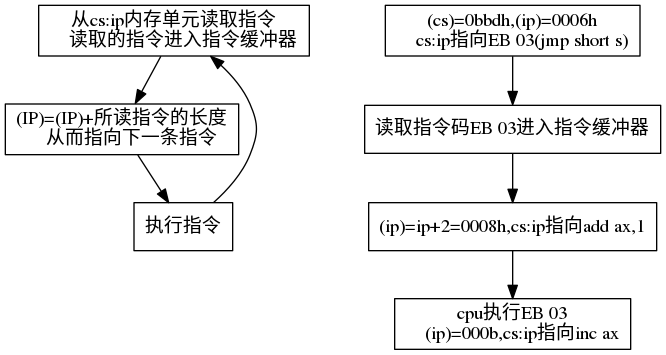
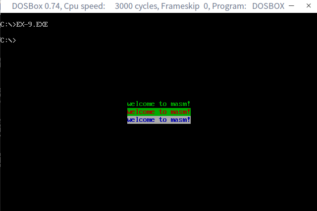

<!-- @import "[TOC]" {cmd="toc" depthFrom=1 depthTo=6 orderedList=false} -->

<!-- code_chunk_output -->

* [转移指令的原理](#转移指令的原理)
	* [1-操作符offest](#1-操作符offest)
	* [2-jmp指令](#2-jmp指令)
	* [3-依据位移进行转移的jmp指令](#3-依据位移进行转移的jmp指令)
	* [4-转移的目的地址在指令中的jmp指令](#4-转移的目的地址在指令中的jmp指令)
	* [5-转移地址在寄存器中的jmp指令](#5-转移地址在寄存器中的jmp指令)
	* [6-转移地址在内存中的jmp指令](#6-转移地址在内存中的jmp指令)
	* [检测点 9.1-1](#检测点-91-1)
	* [检测点 9.1-2](#检测点-91-2)
	* [检测点 9.1-3](#检测点-91-3)
	* [7-jcxz指令](#7-jcxz指令)
	* [检测点9-2](#检测点9-2)
	* [8-loop指令](#8-loop指令)
	* [检测点9-3](#检测点9-3)
	* [9-根据位移进行转移的意义](#9-根据位移进行转移的意义)
	* [10-编译器对转移位移超界的检测](#10-编译器对转移位移超界的检测)
	* [实验９](#实验9)

<!-- /code_chunk_output -->

|指令|含义|
|:---:|:---|
|`offset 标号`|取得标号的偏移地址|
|`jmp short 标号`|**无条件转移**,对`ip`的修改范围为-128~127,对应机器码中包含转移的位移|
|`jmp near ptr 标号`|**无条件转移**,对`ip`的修改范围为-32768~32767,对应机器码中包含转移的位移|
|`jmp far ptr 标号`|**段间转移**,`cs=标号所在的段地址`,`ip=标号在段中的偏移地址`|
|`jmp 16位reg`|`(ip)=(16位reg)`|
|`jmp word ptr 内存单元地址`|内存单元开始处放着一个字是转移的目的偏移地址|
|`jmp dword ptr 内存单元地址`|**段间转移**,内存单元开始处放着两个字,高地址是转移的目的段地址，低地址是转移的目的偏移地址|
|`jcxz 标号`|**有条件转移指令(短指令)**,-128~127,cx=0时偏移,cx!=0时向下执行|
|`loop 标号`|`cx=cx-1`,如果`cx!=0`,转到标号处执行|


# 转移指令的原理

**可以修改IP,或同时修改CS和IP的指令统称为转移指令。**

8086CPU的**转移行为分类**：
* 只修改`ip`,称为段内转移，eg:`jmp ax`
    * 短距离`ip`的修改范围:-128~127,向前最多128，向后最多127
    * 近距离`ip`的修改范围:-32768~32767
* 同时修改`cs`和`ip`，称为段间转移，eg:`jmp 1000:0`

8086CPU的**转移指令分类**：
* 无条件转移指令 eg:`jmp`
* 条件转移指令
* 循环指令 eg:`loop`
* 过程
* 中断

## 1-操作符offest

操作符`offset`在汇编语言中是由编译器处理的符号，功能是取得标号的偏移地址。
```asm
assume cs:codesg
codesg segment
start:
    mov ax,offset start ;相当于mov ax,0
s:
    mov ax,offset s     ;相当于mov ax,3
codesg ends
end start
```

## 2-jmp指令

`jmp`为无条件转移指令，可以只修改`IP`,也可以同时修改`CS`和`IP`。

`jmp`指令要给出两种信息：
1. 转移的目的地址
2. 转移的距离（段间转移、段内短转移、段内近转移）


## 3-依据位移进行转移的jmp指令

`jmp short 标号(转到标号处执行指令)`对`ip`的修改范围为-128~127。对应的机器码中，并不包含转移的目的地址，而是包含转移的位移。

实际上，`jmp short 标号`的功能为：(`ip`)=(`ip`)+8位位移。8位位移=标号处的地址-`jmp`指令后的第一个字节的位置。

`jmp near ptr 标号`的功能为：(`ip`)=(`ip`)+16位位移。

```asm
assume cs:codesg
codesg segment
start:
    mov ax,0        ;b80000
    mov bx,0        ;bb0000
    jmp short s     ;eb03
    add ax,1        ;050100
s:
    inc ax          ;40
codesg ends
end start
```

**CPU在执行jmp指令的时候并不需要目的地址**。



## 4-转移的目的地址在指令中的jmp指令

`jmp far ptr 标号`实现的是段间转移(远转移)。`CS`=标号所在段的段地址；(`IP`)=标号在段中的偏移地址。

```asm
assume cs:codesg

codesg segment
start:
    mov ax,0        ;b8 00 00
    mov bx,0        ;bb 00 00
    jmp far ptr s   ;ea 0b 01 bd 0b;
                    ;高地址bd 0b是转移的段地址0b bd;
                    ;低地址0b 01是偏移地址01 0b
    db 256 dup (0)  ;debug解释为相应的汇编
s:
    add ax,1
    inc ax
codesg ends
end start
```

## 5-转移地址在寄存器中的jmp指令

格式：`jmp 16位reg`
功能：`(ip)`=`(16位reg)`

## 6-转移地址在内存中的jmp指令

1. `jmp word ptr 内存单元地址`(段内转移)。内存单元地址处开始存放着一个字，是转移的目的偏移地址。
2. `jmp dword ptr 内存单元地址`(段间转移)。内存单元地址处开始存放着两个字，高地址是转移的目的段地址，低地址是转移的目的偏移地址。`(CS)`＝(内存单元地址+2),`(IP)`＝(内存单元地址)

## 检测点 9.1-1

使`jmp`执行后，`cs:ip`指向程序的第一条指令。
分析：`jmp word ptr []`使用的是直接给出偏移地址，即这里`ds:[bx+1]`的值要为0
```asm
assume cs:code
data segment
    db 0 0 0
data ends
code segment
start:
    mov ax,data
    mov ds,ax
    mov bx,0
    jmp word ptr [bx+1]
code ends
end start
```

## 检测点 9.1-2

使`jmp`执行后，`cs:ip`指向程序的第一条指令。
```asm
assume cs:code
data segment
    dd 12345678h
data ends
code segment
start:
    mov ax,data
    mov ds,ax
    mov bx,0
    mov [bx],bx         ;mov [bx],0
    mov [bx+2],cs
    jmp dword ptr ds:[0]
code ends
end start
```

## 检测点 9.1-3

用`debug`查看程序，结果如下：
```
2000:1000 be 00 06 00 00 00 ...
```

则CPU执行指令：
```asm
mov ax,2000h
mov es,ax
jmp dword ptr es:[1000h]
```

后,`(cs)`=0006h,`(ip)`=00beh

## 7-jcxz指令

`jcxz`位有条件转移指令，所有的有条件转移指令都是短指令,在对应的机器码中包含转移的位移，而不是目的地址。对`ip`修改范围为-128~127。

格式：`jcxz 标号`(如果`(cx)`=0，转移到标号处执行)
操作：当`cx`=0时，`ip`=`ip+8`位位移；当`cx!=0`时，程序向下执行。

## 检测点9-2

补全程序，利用jcxz指令，在内存2000H段中查找第一个为0的单元，将其偏移地址存储在dx中。

```asm
assume cs:code
code segment
start:mov ax,2000h
    mov ds,ax
    mov bx,0
s:
    mov cl,ds:[bx];
    mov ch,0;
    jcxz ok;
    inc bx;  
    jmp short s 
ok:
    mov dx,bx
    mov ax ,4c00h
    int 21h
code ends
end start
```
## 8-loop指令

`loop`指令为循环指令，所有的循环指令都是短指令。对应的机器码包含转移的位移，而不是目的地址。

格式及操作：`loop 标号`((`cx`)=(`cx`)-1,如果`cx`!=0,转到标号处执行)

## 检测点9-3

补全程序，利用loop指令，实现在内存2000H段中查找第一个为0的单元，将其偏移地址存储在dx中。

```asm
assume cs:code
code segment
start:
    mov ax,2000H
    mov ds,ax
    mov bx,0
s:
    mov cl,[bx]
    mov ch,0
    inc cx      ;ans
    inc bx
    loop s
ok:
    dec bx           
    mov dx,bx
    mov ax,4c00h
    int 21h
code ends
end start
```

## 9-根据位移进行转移的意义

方便了程序员在内存中的浮动装配

## 10-编译器对转移位移超界的检测

## 实验９

内存地址空间中，B 8000h~b ffffh 共32kb的空间,为80*25彩色字符模式的显示缓冲区。

每个字符256种属性(背景色，前景色，闪烁，高亮)。这样一个字符在显示缓冲区占两个字节，低地址存储字符的ascii码，高地址存储字符的属性。这样80*25*2=4000个字节。

显示缓冲区分8页，每页4kb（≈4000b），显示器可以显示任意一页的内容。，一般来讲，显示0页的内容，即b 8000h~b 8f9fh的4000个字节的内容将出现在显示器上。

