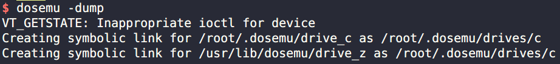

# 王爽汇编语言读书笔记及课后练习

---

usage:
* linux:
    * ubuntu:
        * `sudo apt install dosemu`
        * `stty cols 80 rows 25`
        * `dosemu -dump`
* windows: `dosbox`

---

所有的检测点答案都包含在该章笔记之中。

|章节笔记|
|:---:|
|[第七章笔记](./7/readme.md)|
|[第八章笔记](./8/readme.md)|
|[第九章笔记](./9/readme.md)|
|[第十章笔记](./10/readme.md)|
|[第十一章笔记](./11/readme.md)|
|[第十二章笔记](./12/readme.md)|
|[第十三章笔记](./13/readme.md)|
|[第十四章笔记](./14/readme.md)|
|[第十五章笔记](./15/readme.md)|
|[第十六章笔记](./16/readme.md)|
|[第十七章笔记](./17/readme.md)|